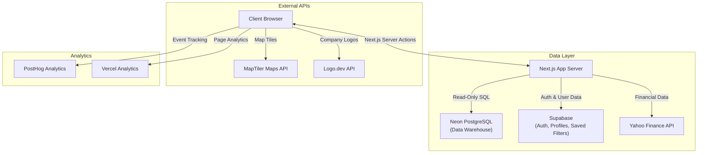

# Bamboo Reports By ResearchNXT

A modern Business Intelligence dashboard built with Next.js App Router, React, and TypeScript. The app delivers account, center, service, and prospect intelligence through rich filtering, data visualization, geospatial analytics, and export workflows.

[](https://vercel.com)
[](https://nextjs.org/)
[](https://react.dev/)
[](https://www.typescriptlang.org/)
[](https://tailwindcss.com/)
[](https://nodejs.org/)
[](https://supabase.com)
[](https://neon.tech/)
[](https://posthog.com/)
[](https://maplibre.org/)
[](LICENSE)

---

## Table of Contents

- [Overview](#overview)
- [Key Features](#key-features)
- [Architecture & Data Flow](#architecture--data-flow)
- [Tech Stack](#tech-stack)
- [Project Structure](#project-structure)
- [Getting Started](#getting-started)
- [Environment Variables](#environment-variables)
- [Authentication & Authorization](#authentication--authorization)
- [Database & Schema](#database--schema)
- [Analytics & Monitoring](#analytics--monitoring)
- [Deployment](#deployment)
- [Troubleshooting](#troubleshooting)
- [Documentation Reference](#documentation-reference)

---

## Overview

Bamboo Reports provides a unified view of business entities (**Accounts**, **Centers**, **Services**, **Functions**, **Tech**, and **Prospects**). The dashboard combines high-performance data grids with geospatial analytics and charting to empower decision-makers.

### Core Value Proposition
- **High Signal-to-Noise:** Designed for rapid filtering and drilling down into large datasets.
- **Geospatial Intelligence:** Visualize delivery center density with clustered markers and state-level choropleth maps.
- **Persistence:** Save complex filter configurations to the cloud (Supabase) for recurring reporting tasks.
- **Exportability:** Generate boardroom-ready Excel reports with multi-sheet support and company logos.
- **Real-Time Notifications:** Track recently updated accounts and table records with an in-app notification system.

---

## Key Features

### Dashboard and Insights
- **Smart Summary Cards:** Real-time filtered vs. total counts per entity.
- **Interactive Charts:** Recharts-powered Pie/Donut charts and Highcharts treemaps for categorical breakdowns (Region, Nature, Revenue, Employees, Technology).
- **Tabbed Navigation:** Seamless switching between Accounts, Centers, Prospects, and Services contexts.
- **Geospatial Analytics:**
  - MapTiler (MapLibre) cluster map optimized for 5000+ center points.
  - State-level choropleth map with disputed boundary handling (configurable per geopolitical viewpoint).

### Advanced Filtering Engine
- **Multi-Select Filters:** Country, Region, Industry, Category, Nature, Technology, Functions, and more.
- **Precision Slicing:** "Include" vs. "Exclude" toggle per filter group.
- **Range Sliders:** Revenue, Employee count, and Years in India sliders with logarithmic scaling.
- **Saved Filters:** Persist complex filter sets to Supabase with Row-Level Security isolation.
- **Debounced Search:** 300ms debounce on keyword inputs to optimize performance.
- **Active Filter Count:** Visual badge indicator showing the number of applied filters.

### Data Management
- **Paginated Tables:** 50 items per page, optimized for performance with `React.memo`.
- **Row-Level Details:** Comprehensive tabbed dialog views for Accounts, Centers, and Prospects.
- **Type Safety:** Shared TypeScript definitions ensuring consistency from database to UI.

### Export and Integrations
- **Excel Exports:** Native `.xlsx` generation using ExcelJS with ZIP compression.
- **Multi-Sheet Support:** Export all filtered entities into separate sheets in a single file.
- **Logo Integration:** Automated company logo fetching via Logo.dev API with fallback initials.
- **Financial Data:** Stock information and financial metrics via Yahoo Finance integration.

### Notifications
- **Recently Updated Accounts:** Tracks account-level changes with grouped notifications.
- **Recently Updated Records:** Table-level update summaries across all entities.
- **Unread Count Badge:** Bell icon with visual count indicator.
- **Feature Flag:** Toggle via `NEXT_PUBLIC_NOTIFICATIONS_ENABLED` environment variable.

---

## Architecture & Data Flow

The application follows a **Server-First** data architecture with **Client-Side** interactivity.



### Data Fetching Strategy
1. **Initial Load:** `Promise.all` fetches metadata (filters, counts) and initial page data concurrently via Server Actions.
2. **Filtering:** User actions update React state; client-side filtering and chart aggregation run locally for responsiveness.
3. **Server Actions:** Modular action files (`app/actions/data.ts`, `app/actions/saved-filters.ts`, `app/actions/financial.ts`, `app/actions/notifications.ts`) handle all database communication.
4. **Runtime Behavior:** No custom in-memory cross-request cache; server actions fetch fresh data with retry logic (3 retries, exponential backoff).

---

## Tech Stack

For a comprehensive breakdown of every technology used in this project, see the **[Tech Stack Reference](documentation/tech-stack.md)**.

### Core Framework
| Technology | Version | Purpose |
|------------|---------|---------|
| **Next.js** | 14.2.x | App Router, Server Actions, SSR |
| **React** | 18.2.x | Component Library, Hooks |
| **TypeScript** | 5.x | Strict Type Safety |

### UI and Styling
| Technology | Purpose |
|------------|---------|
| **Tailwind CSS 3.4** | Utility-first styling with custom animations |
| **shadcn/ui** | Accessible component primitives (Radix UI) |
| **Lucide React** | Consistent iconography |
| **next-themes** | Dark/Light mode support |
| **Geist** | Font and design system |

### Data Visualization
| Technology | Purpose |
|------------|---------|
| **Recharts** | Pie/Donut charts for categorical breakdowns |
| **Highcharts** | Advanced treemap visualizations (Technology) |
| **MapLibre GL + MapTiler** | Cluster maps and state choropleth |

### Backend and Data
| Technology | Purpose |
|------------|---------|
| **Neon PostgreSQL** | Primary BI data warehouse (serverless, read-only) |
| **Supabase** | Authentication, user profiles, saved filters |
| **Yahoo Finance 2** | Stock and financial data integration |
| **ExcelJS** | Native `.xlsx` report generation |
| **Zod** | Schema validation for forms and inputs |

### Analytics and Monitoring
| Technology | Purpose |
|------------|---------|
| **PostHog** | Product analytics and event tracking |
| **Vercel Analytics** | Page performance monitoring |

---

## Project Structure

```
bamboo-reports-nextjs/
├── app/                            # Next.js App Router
│   ├── (auth)/                     # Auth route group (signin, signup)
│   ├── actions/                    # Modular Server Actions
│   │   ├── data.ts                 # Core data fetching (accounts, centers, etc.)
│   │   ├── saved-filters.ts        # Saved filter CRUD operations
│   │   ├── financial.ts            # Financial data queries
│   │   ├── notifications.ts        # Notification logic
│   │   └── system.ts              # System diagnostics
│   ├── actions.ts                  # Central server action re-exports
│   ├── layout.tsx                  # Root layout with providers
│   ├── page.tsx                    # Main dashboard entry point
│   └── providers.tsx               # Analytics providers (PostHog)
│
├── components/                     # React Components
│   ├── auth/                       # Authentication UI (signin/signup forms)
│   ├── cards/                      # Card component variants
│   ├── charts/                     # Recharts + Highcharts visualizations
│   ├── dashboard/                  # Summary cards and hero stats
│   ├── dialogs/                    # Detail views (Account, Center, Prospect)
│   ├── export/                     # Excel export workflow
│   ├── filters/                    # Sidebar filter UI and controls
│   ├── layout/                     # Header and Footer
│   ├── maps/                       # MapLibre cluster + choropleth maps
│   ├── states/                     # Loading and error state components
│   ├── tables/                     # Data grid row components
│   ├── tabs/                       # Tab views (Accounts, Centers, etc.)
│   └── ui/                         # Shared design system (shadcn/ui)
│
├── hooks/                          # Custom React Hooks
│   ├── use-auth-guard.ts           # Authentication guard
│   ├── use-dashboard-data.ts       # Data fetching and loading state
│   ├── use-dashboard-filters.ts    # Complex filter state management
│   ├── use-notifications.ts        # Notification tracking
│   ├── use-range-filter.ts         # Range slider logic
│   ├── use-recently-updated-*.ts   # Recently updated tracking
│   └── use-saved-filters.ts        # Saved filter persistence
│
├── lib/                            # Utilities & Configuration
│   ├── analytics/                  # PostHog client, events, tracking
│   ├── auth/                       # Role-based access control
│   ├── config/                     # Environment, MapTiler, notifications
│   ├── dashboard/                  # Dashboard utility functions
│   ├── db/                         # Neon PostgreSQL client + retry logic
│   ├── finance/                    # Financial data utilities
│   ├── supabase/                   # Supabase client factory
│   ├── utils/                      # Helpers (chart, export, filter, general)
│   ├── validators/                 # Zod validation schemas
│   └── types.ts                    # Shared TypeScript interfaces
│
├── documentation/                  # Technical documentation
│   ├── database/                   # SQL migrations and master schema
│   ├── sql/                        # SQL utility scripts
│   ├── tech-stack.md               # Detailed tech stack reference
│   ├── project-architecture.md     # Architecture and data flow
│   ├── schema-migration-guide.md   # Database schema reference
│   ├── developer-workflow.md       # Developer guide and coding standards
│   ├── supabase-auth-setup.md      # Auth setup guide
│   ├── supabase-saved-filters.md   # Saved filters spec
│   ├── logo-integration.md         # Logo.dev integration guide
│   └── map-disputed-boundaries.md  # Choropleth boundary handling
│
├── types/                          # Additional type definitions
├── public/                         # Static assets (logos, images, data)
└── styles/                         # Additional stylesheets
```

---

## Getting Started

### Prerequisites
- **Node.js 18.17+**
- **npm** (v9+)
- **Neon PostgreSQL:** Connection string for the data warehouse.
- **Supabase Project:** For authentication and user state.
- **MapTiler API Key:** For the geospatial views.

### Installation

1. **Clone the Repository:**
    ```bash
    git clone https://github.com/Bamboo-Reports/bamboo-reports-nextjs.git
    cd bamboo-reports-nextjs
    ```

2. **Install Dependencies:**
    ```bash
    npm install
    ```

3. **Environment Setup:**
    Duplicate the example file and fill in your secrets.
    ```bash
    cp .env.example .env.local
    ```

4. **Run Development Server:**
    ```bash
    npm run dev
    ```
    Open [http://localhost:3000](http://localhost:3000) to view the app.

### Available Scripts

| Command | Description |
|---------|-------------|
| `npm run dev` | Start development server with hot reload |
| `npm run build` | Create production build |
| `npm run start` | Start production server |
| `npm run lint` | Run ESLint checks |

---

## Environment Variables

| Variable | Required | Description |
|----------|----------|-------------|
| `DATABASE_URL` | **Yes** | Neon PostgreSQL connection string. |
| `NEXT_PUBLIC_SUPABASE_URL` | **Yes** | Your Supabase project URL. |
| `NEXT_PUBLIC_SUPABASE_ANON_KEY` | **Yes** | Supabase public anon key (safe for client). |
| `NEXT_PUBLIC_MAPTILER_KEY` | **Yes** | MapTiler public key for rendering map tiles. |
| `NEXT_PUBLIC_MAPTILER_STATE_STYLE_ID` | No | MapTiler style ID for state choropleth view. |
| `NEXT_PUBLIC_MAPTILER_CITY_STYLE_ID` | No | MapTiler style ID for city-level view. |
| `NEXT_PUBLIC_MAPTILER_STYLE_ID` | No | Legacy fallback style ID (used if mode-specific IDs are not set). |
| `NEXT_PUBLIC_MAP_VIEWPOINT_ISO2` | No | Geopolitical viewpoint for choropleth (e.g., `IN` for India). |
| `NEXT_PUBLIC_LOGO_DEV_TOKEN` | No | Logo.dev publishable token for company logos. |
| `NEXT_PUBLIC_POSTHOG_KEY` | No | PostHog project API key for analytics. |
| `NEXT_PUBLIC_POSTHOG_HOST` | No | PostHog host URL (defaults to PostHog cloud). |
| `NEXT_PUBLIC_NOTIFICATIONS_ENABLED` | No | Feature flag: `enabled` or `disabled`. |
| `NEXT_PUBLIC_ENVIRONMENT_LABEL` | No | Environment tag displayed in the UI: `DEV`, `PROD`, or empty. |

---

## Authentication & Authorization

The app delegates identity management to **Supabase Auth**.

- **Sign Up/Login:** Standard Email/Password flow.
- **Session Persistence:** Handled via HTTP-only cookies (Next.js server-side).
- **Role-Based Access Control:**
  - `viewer` — Read-only access to the dashboard.
  - `admin` — Read access plus data export capabilities.
- **User Data:**
  - **`public.profiles`**: Stores user metadata (First Name, Last Name, Email, Role).
  - **`public.saved_filters`**: Stores JSON blobs of user's filter configurations.
- **Security:** Row-Level Security (RLS) ensures full data isolation between users.

> **Setup Guide:** Follow the [Supabase Auth Setup](documentation/supabase-auth-setup.md) guide to initialize your Supabase project tables.

---

## Database & Schema

The core BI data resides in **Neon PostgreSQL**. All tables follow strict `snake_case` naming.

### Core Tables
| Table | Description | Primary Key |
|-------|-------------|-------------|
| `accounts` | Top-level company entities with HQ details, financials, workforce | `account_global_legal_name` |
| `centers` | Delivery centers / office locations with geospatial data | `cn_unique_key` |
| `services` | Service-line rows linked to centers | `uuid` |
| `functions` | Function rows linked to centers | `uuid` |
| `tech` | Technology stack rows (software, vendors, categories) | `uuid` |
| `prospects` | Contact/lead rows linked to accounts | `uuid` |

### Audit Tables (in `audit` schema)
- `audit.import_runs` — Data import tracking
- `audit.field_change_events` — Field-level audit log
- `audit.notification_reads` — Notification read status

### Key Relationships
- `centers` link to `accounts` via `account_global_legal_name`
- `services`, `functions`, and `tech` link to `centers` via `cn_unique_key`
- `prospects` link to `accounts` via `account_global_legal_name`

> **Reference:** See the [Schema Migration Guide](documentation/schema-migration-guide.md) for complete column definitions and table relationships.

---

## Analytics & Monitoring

### PostHog
Product analytics integrated via `posthog-js`. Tracks:
- Dashboard page views and session duration
- Filter interactions and saved filter usage
- Export actions and tab navigation
- User identification tied to Supabase user ID

Configuration: Set `NEXT_PUBLIC_POSTHOG_KEY` and `NEXT_PUBLIC_POSTHOG_HOST` environment variables.

### Vercel Analytics
Page performance monitoring via `@vercel/analytics`. Automatically tracks Core Web Vitals when deployed on Vercel.

---

## Deployment

### Vercel (Recommended)

This project is optimized for Vercel.

1. **Push to GitHub.**
2. **Import in Vercel:** Select the repository.
3. **Configure Environment Variables:** Add all required keys from the table above.
4. **Deploy:** Vercel auto-detects Next.js and builds.

Subsequent pushes to the `main` branch trigger automatic deployments.

### Build Configuration
- ESLint errors are ignored during builds (`eslint.ignoreDuringBuilds: true`)
- TypeScript errors are ignored during builds (`typescript.ignoreBuildErrors: true`)
- Images are unoptimized (static export compatible)

---

## Troubleshooting

| Issue | Possible Cause | Solution |
| :--- | :--- | :--- |
| **Map not loading** | Invalid MapTiler Key | Check `NEXT_PUBLIC_MAPTILER_KEY`. Ensure the key is active and has map tile access. |
| **"Database connection failed"** | Neon scaling / network | The Neon instance might be sleeping. Retry after a few seconds. Verify `DATABASE_URL`. |
| **Auth errors (401/403)** | Supabase config | Verify `NEXT_PUBLIC_SUPABASE_URL` and `ANON_KEY`. Check RLS policies in Supabase dashboard. |
| **Missing logos** | Logo.dev token | Ensure `NEXT_PUBLIC_LOGO_DEV_TOKEN` is set. If omitted, fallback initials are used. |
| **Notifications not showing** | Feature flag | Set `NEXT_PUBLIC_NOTIFICATIONS_ENABLED=enabled` in your environment. |
| **Charts not rendering** | Data issue | Check browser console for errors. Ensure data is being returned from server actions. |
| **Choropleth seams visible** | MapTiler style | Disable disputed boundary layers in your MapTiler style. See [Map Disputed Boundaries](documentation/map-disputed-boundaries.md). |
| **Export button disabled** | User role | Only `admin` users can export. Update the role in the `profiles` table. |

---

## Documentation Reference

Detailed documentation for specific subsystems lives in the `documentation/` folder:

| Document | Description |
|----------|-------------|
| [**Tech Stack**](documentation/tech-stack.md) | Comprehensive technology reference with versions, purposes, and categories |
| [**UI-to-Column Mapping**](documentation/ui-column-mapping.md) | Complete mapping of every UI label to its database column (filters, tables, dialogs, charts) |
| [**Project Architecture**](documentation/project-architecture.md) | High-level design, server actions, state management, and integrations |
| [**Schema Guide**](documentation/schema-migration-guide.md) | Deep dive into the data model, table relationships, and migration paths |
| [**Developer Workflow**](documentation/developer-workflow.md) | Guide for common tasks, coding standards, and troubleshooting |
| [**Supabase Auth**](documentation/supabase-auth-setup.md) | Setting up the `profiles` table, RLS policies, and auth triggers |
| [**Saved Filters**](documentation/supabase-saved-filters.md) | Technical spec for the saved filters JSON structure |
| [**Logo Integration**](documentation/logo-integration.md) | Setup and usage guide for the Logo.dev integration |
| [**Map Disputed Boundaries**](documentation/map-disputed-boundaries.md) | State choropleth disputed-boundary behavior and alias rules |

---

## License

Proprietary software owned by ResearchNXT.
